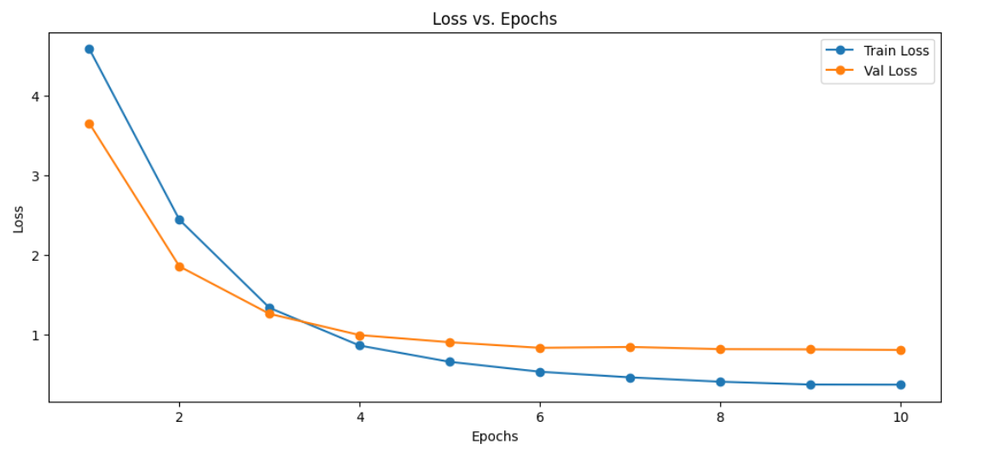
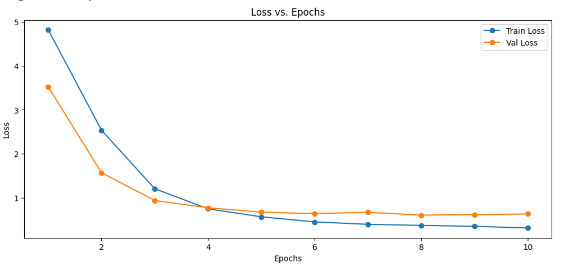
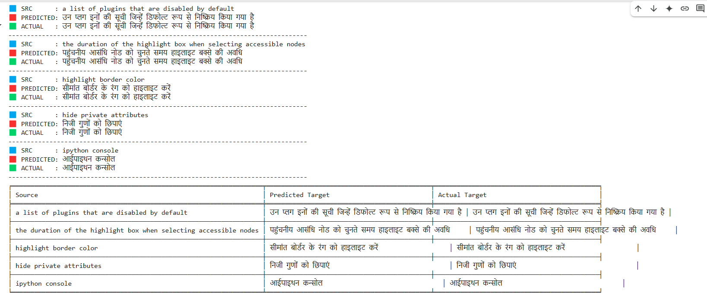

# Neural Machine Translation – English to Hindi 🇮🇳🇬🇧

This repository contains an implementation of **Neural Machine Translation (NMT)** models to translate sentences from **English to Hindi** using both:

- 🔁 **LSTM Encoder-Decoder with Attention**
- ⚡ **Transformer Encoder-Decoder**

Developed as part of an **Assignment ** for the course `CSL7640: Natural Language Understanding` at IIT Jodhpur (AY 2024–25).

---

## 📁 Folder Structure

```
.
├── Assignment.py      # Combined LSTM + Transformer code                                       
│── lstm_loss_curve.png
│── transformer_loss_curve.png
│── sample_predictions.png
```

---

## 🧠 Problem Statement

Translate English sentences into grammatically correct Hindi using an NMT system. The dataset is aligned and tokenized with `<sos>` and `<eos>` tokens added to both source and target sentences.

---

## 📦 Dataset

- 📥 **Source**: IIT Bombay English-Hindi parallel corpus  
- Files used:
  - `english.train.txt` and `hindi.train.txt` for training
  - `english.test.txt` and `hindi.test.txt` for evaluation

> Note: Due to licensing, dataset files are not included. Please download them from [this Google Drive link](https://drive.google.com/file/d/1bEK6RCdnXIqg8JGrJIMvDaAM-baalGwt/view).

---

## 🛠 Models Implemented

### 🔁 LSTM Encoder-Decoder with Attention
- Bidirectional LSTM encoder
- Unidirectional decoder with dot-product attention
- Teacher forcing for training

### ⚡ Transformer Encoder-Decoder
- Positional Encoding
- Multi-head Self-Attention
- Layer Normalization
- Learned embeddings

---

## 📊 Results

| Model       | BLEU Score | Notes                      |
|-------------|------------|----------------------------|
| LSTM        | 8.19      | Performs well on short seq |
| Transformer | 13.88      | Faster convergence, better long-term dependencies |

---

## 📈 Training Curves

> 🔻 Below plots show training and validation loss:

### LSTM Model


### Transformer Model


---

## 📝 Sample Translations

> 🔻 Model predictions vs. ground truth examples:



---

## 📎 Colab Link

- [Open in Colab](https://colab.research.google.com/drive/1RLdNO6GJrD7VlnCMw_jvJ7Lf8KQkXN6i?usp=sharing)

---

---

## 👥 Members

- Jyotishman Das 
- Denzel Lenshanglen Lupheng 
- Suvadip Chakraborty 
- Mehul Sah

---

## 📜 License

This project is for academic use only under IIT Jodhpur coursework.
